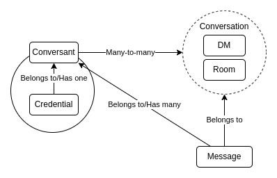

# Chatter

A simple chat application build with Phoenix LiveView.

## System Overview

The relationships between the various domain objects are perhaps best described by this diagram:

## Getting Started

To start your Phoenix server:

  * Install dependencies with `mix deps.get`
  * Create and migrate your database with `mix ecto.setup`
  * Start Phoenix endpoint with `mix phx.server` or inside IEx with `iex -S mix phx.server`

Now you can visit [`localhost:4000`](http://localhost:4000) from your browser.
